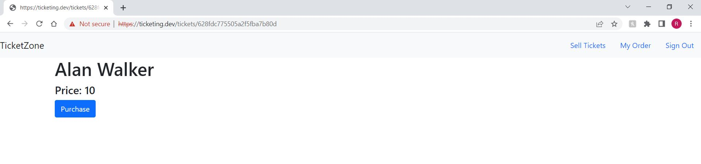
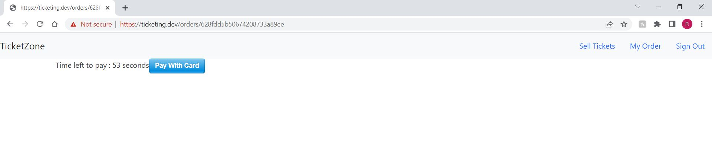

# Ticketing App Using Microservice Architecture

## Description

#### Ticketing App is used for booking popular shows tickets. Users can post tickets to sell and purchase tickets. Users are given a x minute window to purchase a ticket. The app features the use of different microservices interacting using event bus and avoid concurrency issues using versioning of events. The development is done using test based approach which helps in catching errors and sucessful pull requests on git.

### Tech Stack

- Node js Express & typeScript :For creating Backend Services
- mongo DB :Database
- React (nextJS) :For Server Side rendering
- Docker :Creating conatiners
- Kubernetes :Running multiple container and networking
- Skaffold :Automating Build process
- ingress nginx :Load Balancer + ingress controller (https://kubernetes.github.io/ingress-nginx/deploy/#quick-start)
- Jest : Library to write and run independent test cases locally.
- NATS Streaming Server : Event Bus

  List of Microservices Used::

- Auth Service : User Login/Logout/Signup/Signin
- Ticket Service : Create/Edit/Delete/Freeze Ticket
- Order Service : Create/Cancel Order
- Payment Service : Initiate Payment Using Stripe Api
- Expiry Service : Timer for Payment for Order

##### Auth Service

The key highlights of authentication service

- ###### Exception Handling: It uses express-validation and Custom defined Errors subclass of Errors. The errors return are consistent and cover lots of scenarios for a production ready code.
- ###### DataBaseIntegration: Defining interfaces for User model and User Document so that errors can be avoided.
- ###### Password Hashing : Implementing password hasing using scrypt as Async. Password hasing improves security on response send to client.

##### Using user defined middlewares for Requestvalidation , Current-user , AuthRequired And using jwt token under cookies

- ##### Signup :
- ##### SignIn :
- ##### Logout :
- ##### CurrentUser :

##### Ticket Service

The ticket service has api for create , update , get tickets with keyword title and cost.

- Error First driven approach for ticket service. Writing out all test cases and then doing the implementation.
- NATS Streaming Server as Event Bus , Port Forwarding , Queue groups(make sure event goes to one instance)
- Heart Beats and Event Miss Sceanrios
- Handling Concurrency Issues : To have database in a service maintaining the Seq of events in Publisher , match the seq-1 in listener.
- Using Fake or Mock fuctions from jest to simulate the nats publisher command.

##### Order Service

The order service has reference to ticket. It handles creation and cancellation of ticket.

- Publishing events upon creation and deletion.
- Database sync using versions . Avoding Concurrency issues . Maintain versions in each database for every event process only if diff by 1. Otherwise reemit the event.
- Use of Mongoose if current Update ( Optimistic Concurrency Control ).

##### Expiry Service

The Expiry Module recieves order creation event and waits till expiry and emits expiration completion event.

##### Payment Service

The payment service recieves an order created and order cancelled event and emits payment complete event.

- Uses Stripe for payment transactions
- Update the order status as complete after payment complete event.

##### Client Module

This project does not heavily focus on frontent , the focus of this project is mostly on microservices .Next Js is used to make client in javascript. The main highlight of client app is using the Hooks & components and getInitial prop Method for server side prefetch of data.

##### NATS STREAMING SERVER

- Singleton Class for Nats streaming client. Handles event flow from one service to other service. Maintains heartBeat mechanism. Re-Emmitting missing events on timer.

##### Common Shared Library

The main objective of shared library is to use the code in multiple services.

- Error Handling Modules
- Middlewares
- Events (Base class for publisher and listeners and Subjects Enums)
